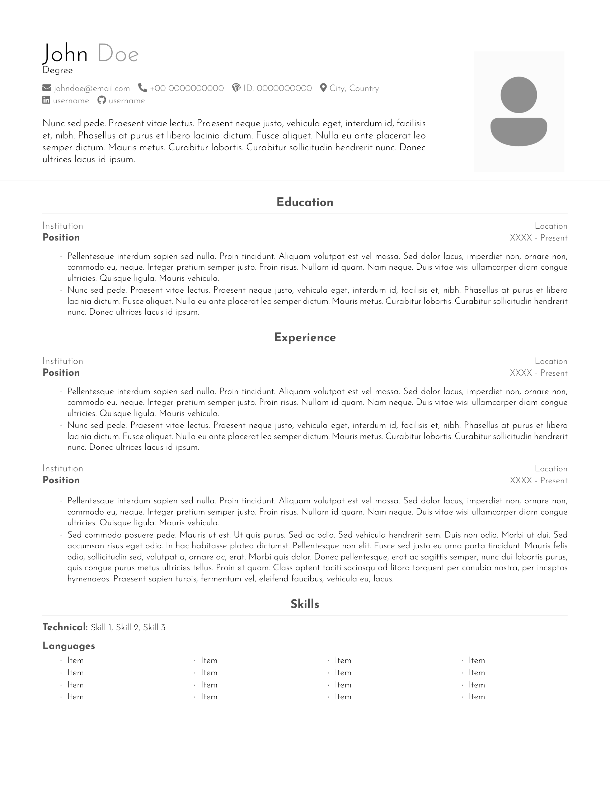
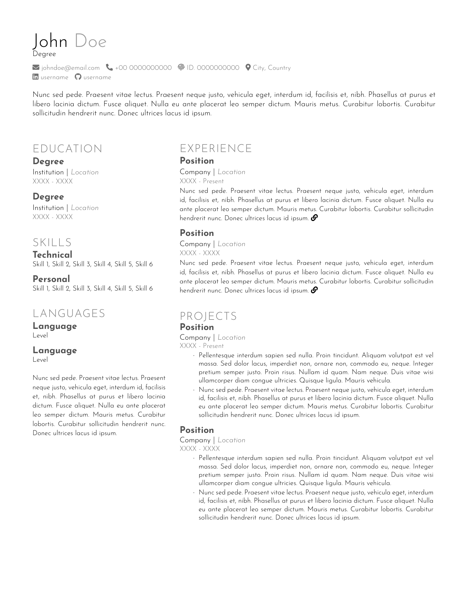
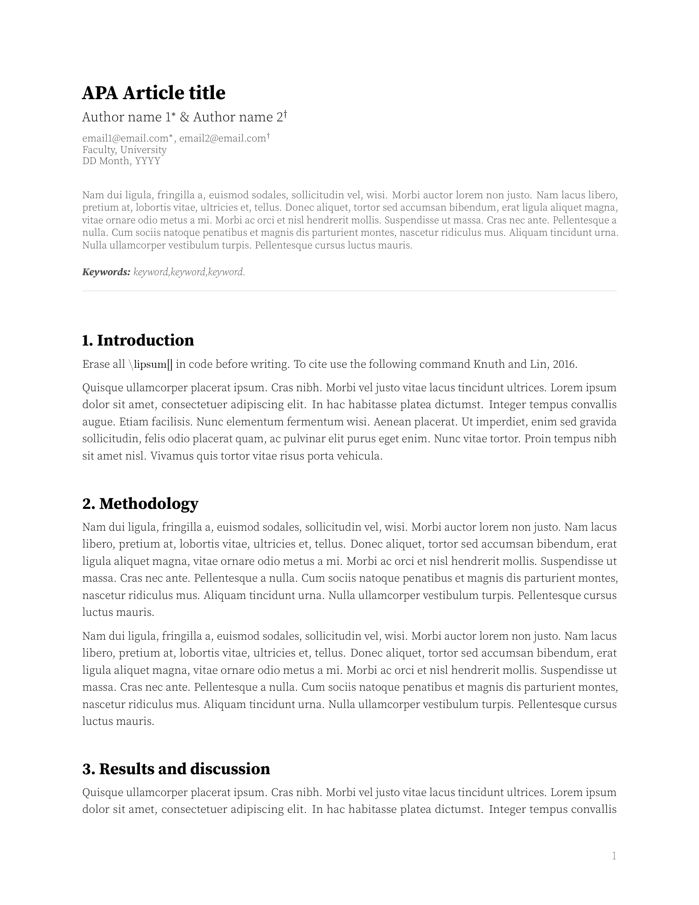
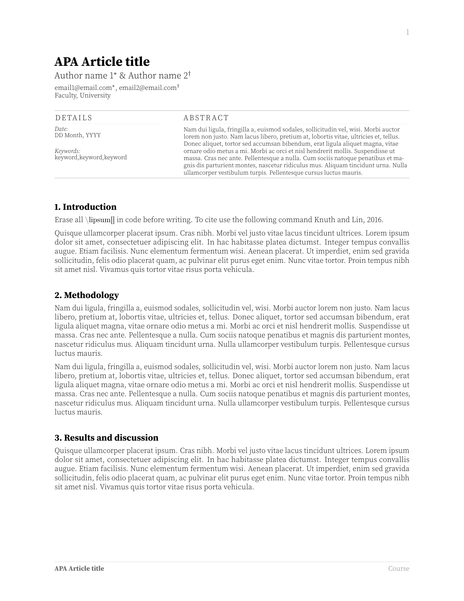
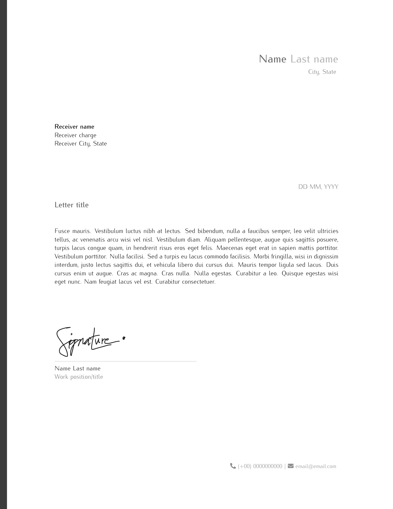
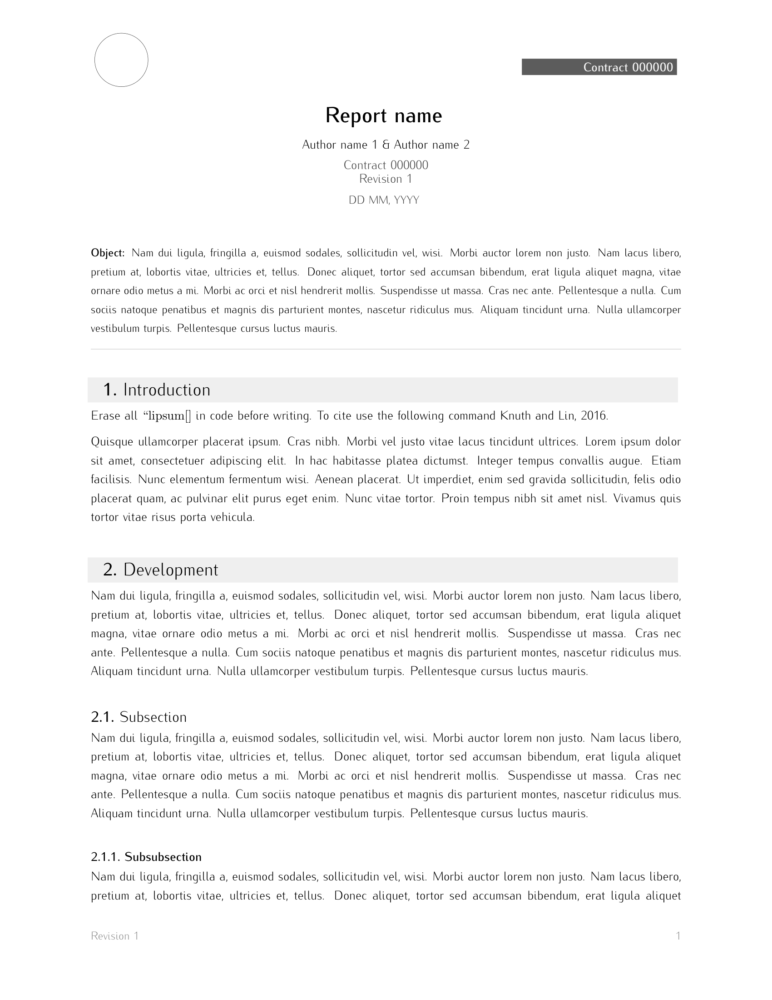
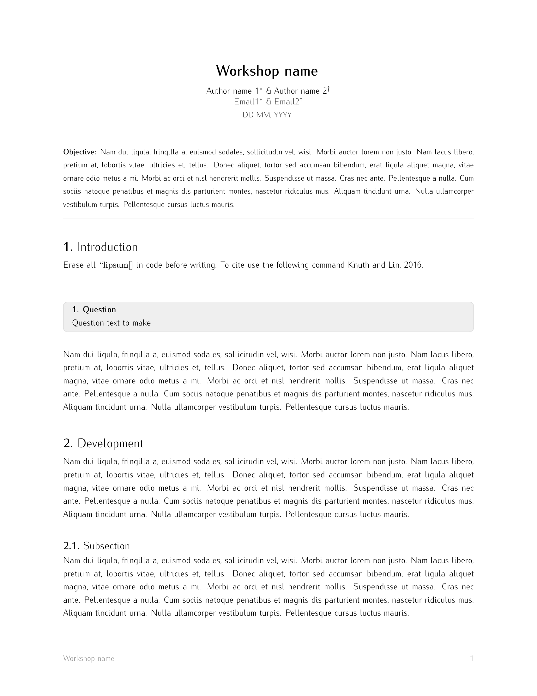

# LaTeX Templates repository
A collection of customizable LaTeX templates designed for various use cases, ranging from university reports to resumes, letters, or general use documents. Whether you're a student, researcher, or professional, this repository provides well-structured and easy-to-use templates. The `.cls` files must not be modified directly; instead, users should create their own `.tex` files that utilize these classes to ensure proper formatting and functionality.

## Template types
- **Resumes/CVs**: 2 Modern and professional templates for creating CVs. 1 ATS-friendly version.
- **Academic document**: 2 Templates for articles, reports or general use documents with APA formatting.
- **Letters**: Elegant, simple and customizable letter templates.
- **Reports**: Template for technical reports with APA formatting.
- **Workshop**: Template for workshop reports with APA formatting.

    <table width="100%" margin-left="auto" margin-right="auto">
        <tbody>
            <th colspan="2">CVs</th>
           	<tr>
                <th>CV 01</th>
               	<th>CV 02</th>
           	</tr>
           	<tr>
               	<td width="50%">
                    
               	</td>
               	<td width="50%">
                    
                </td>
           	</tr>
        </tbody>
    </table>
    <table width="100%" margin-left="auto" margin-right="auto">
        <tbody>
            <th colspan="2">Academic</th>
           	<tr>
                <th>APA 01</th>
               	<th>APA 02</th>
           	</tr>
           	<tr>
               	<td width="50%">
                    
               	</td>
               	<td width="50%">
                    
                </td>
           	</tr>
        </tbody>
    </table>
    <table width="100%" margin-left="auto" margin-right="auto">
        <tbody>
            <th colspan="3">Others</th>
           	<tr>
                <th>Letter</th>
               	<th>Report</th>
                <th>Workshop</th>
           	</tr>
           	<tr>
               	<td width="33%">
                    
               	</td>
               	<td width="33%">
                    
                </td>
                <td width="33%">
                    
                </td>
           	</tr>
        </tbody>
    </table>

## How to use
All templates are fully compatible with both local LaTeX editors and online editors like *Overleaf*. To use a template, simply create a new `.tex` file and include the corresponding class file using the `\documentclass{}` command. Customize the content as needed while maintaining the structure and functions provided by the class files.

> If you are using *Overleaf* you must download the entire repository, convert the desired template folder to a zip file and upload it to your project. This way you will have access to all the necessary files for the template to work properly.
